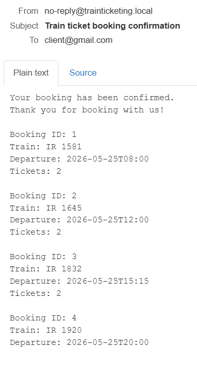
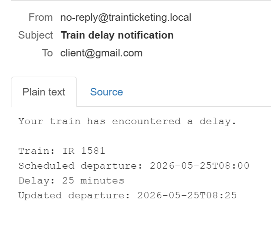

# Train Ticketing Application

## Overview

This project is a Spring Boot train ticketing application with:

- customer route search between stations
- direct and multi-change itineraries
- ticket booking with overbooking protection
- confirmation emails for bookings
- admin operations for trains, routes, bookings, and delays
- delay notification emails for affected customers
- a simple browser UI for route search and booking

The backend uses:

- Spring Boot
- Spring Web
- Spring Data JPA
- H2 database
- Jakarta Validation
- JavaMail

## Solution Summary

The application models the railway system with these main entities:

- `Train`: train name and seat capacity
- `Route`: route name and ordered route stops
- `RouteStop`: station, stop order, and minutes from route departure
- `Station`: station name
- `TrainSchedule`: a train running a route at a specific time
- `Booking`: customer email, schedule, ticket count, and booking time

### Booking logic

When a booking is created:
- the backend locks the selected schedule
- it sums the already booked tickets for that schedule
- it compares the requested tickets with the train capacity
- it rejects the request if it would overbook the train
- it saves the booking and sends a confirmation email

### Search logic

Route search works on top of `TrainSchedule` and `RouteStop` data:

- each schedule is expanded into all its valid station-to-station legs/segments
- the search can return direct trips or itineraries with changes
- a minimum transfer time is enforced between trains
- if no connection exists, the backend returns a clear error message

### Admin logic

The admin can:

- create, update, delete, and list trains
- create, update, delete, and list routes with stations
- list bookings for a specific train
- list schedules
- mark a train schedule as delayed (this will also send an email to all users that have booked this train)


## Running the Application

### Requirements

- JDK installed
- `JAVA_HOME` configured
- I used Docker for running MailHog & Postman for testing the API

### Start the application

The project is configured for a local SMTP catcher:

```properties
spring.mail.host=localhost
spring.mail.port=1025
booking.mail.from=no-reply@trainticketing.local
```

In order to start the application, I first run:

```powershell
docker start mailhog
```

Mail inbox:

- [http://localhost:8025](http://localhost:8025)

This allows using fake emails like `test@example.com`.

Then I run the main application (Application.java).
The default app URL is:
- [http://localhost:8080](http://localhost:8080)

## Demo Data

On startup, demo data is inserted if there are no schedules yet.

Seeded stations include:

- Bucharest North
- Ploiesti West
- Sinaia
- Predeal
- Brasov
- Sighisoara
- Cluj-Napoca
- Oradea

Seeded demo routes include:

- Bucharest - Brasov
- Brasov - Cluj-Napoca
- Cluj-Napoca - Oradea

Seeded schedules are created for the fixed demo date `2026-05-25`.

## Web UI

I created a simple web application for default features for a simple user:

- [http://localhost:8080/index.html](http://localhost:8080/index.html)

Supported UI features:

- searchable station dropdowns loaded from the database
- departure date selection
- route search
- display of direct or multi-change itineraries
- itinerary booking
- popup confirmation after successful booking

## Supported Functionalities

## A) Book one or multiple tickets on trains

### Functionality

- book tickets for a single train schedule
- book tickets for a full itinerary with one or more train segments
- prevent overbooking using the known bookings for the train schedule
- send confirmation email after booking

### Single-schedule booking

Endpoint:

- `POST http://localhost:8080/api/bookings`

Input:

```json
{
  "scheduleId": 1,
  "customerEmail": "test@example.com",
  "numberOfTickets": 2
}
```

Successful output:

```json
{
  "bookingId": 1,
  "customerEmail": "test@example.com",
  "numberOfTickets": 2,
  "trainName": "IR 1581",
  "departureTime": "2026-05-25T08:00:00"
}
```

Input:

```json
{
  "scheduleId": 1,
  "customerEmail": "test@example.com",
  "numberOfTickets": 50
}
```

Overbooking output:

```json
{
  "type": "about:blank",
  "title": "Booking conflict",
  "status": 409,
  "detail": "Only 8 seats are still available for this train",
  "instance": "/api/bookings"
}
```

### Full-itinerary booking

Endpoint:

- `POST http://localhost:8080/api/bookings/itinerary`

Input:

```json
{
  "scheduleIds": [1, 3],
  "customerEmail": "test@example.com",
  "numberOfTickets": 1
}
```

Successful output:

```json
{
  "customerEmail": "test@example.com",
  "numberOfTickets": 1,
  "segmentCount": 2,
  "bookings": [
    {
      "bookingId": 21,
      "customerEmail": "test@example.com",
      "numberOfTickets": 1,
      "trainName": "IR 1581",
      "departureTime": "2026-05-25T08:00:00"
    },
    {
      "bookingId": 22,
      "customerEmail": "test@example.com",
      "numberOfTickets": 1,
      "trainName": "IR 1734",
      "departureTime": "2026-05-25T11:00:00"
    }
  ]
}
```

Example of email when booking for a trip from Bucharest North to Oradea with 3 train changes:


## B) Find possible departure and arrival times between two stations

### Functionality

- search between two stations
- support direct links
- support routes that require changeovers
- show an appropriate error if no route exists

Endpoint:

- `GET /api/search?fromStation=...&toStation=...&departureDate=...`

### Example: direct route / one change

Input:

```text
GET http://localhost:8080/api/search?fromStation=Bucharest%20North&toStation=Predeal&departureDate=2026-05-25
```

Output:

```json
[
  {
    "segments": [
      {
        "scheduleId": 1,
        "trainName": "IR 1581",
        "fromStation": "Bucharest North",
        "toStation": "Predeal",
        "departureTime": "2026-05-25T08:00:00",
        "arrivalTime": "2026-05-25T09:45:00"
      }
    ],
    "numberOfChanges": 0,
    "departureTime": "2026-05-25T08:00:00",
    "arrivalTime": "2026-05-25T09:45:00"
  },
  {
    "segments": [
      {
        "scheduleId": 1,
        "trainName": "IR 1581",
        "fromStation": "Bucharest North",
        "toStation": "Ploiesti West",
        "departureTime": "2026-05-25T08:00:00",
        "arrivalTime": "2026-05-25T08:35:00"
      },
      {
        "scheduleId": 2,
        "trainName": "IR 1645",
        "fromStation": "Ploiesti West",
        "toStation": "Predeal",
        "departureTime": "2026-05-25T12:35:00",
        "arrivalTime": "2026-05-25T13:45:00"
      }
    ],
    "numberOfChanges": 1,
    "departureTime": "2026-05-25T08:00:00",
    "arrivalTime": "2026-05-25T13:45:00"
  },
  {
    "segments": [
      {
        "scheduleId": 1,
        "trainName": "IR 1581",
        "fromStation": "Bucharest North",
        "toStation": "Sinaia",
        "departureTime": "2026-05-25T08:00:00",
        "arrivalTime": "2026-05-25T09:10:00"
      },
      {
        "scheduleId": 2,
        "trainName": "IR 1645",
        "fromStation": "Sinaia",
        "toStation": "Predeal",
        "departureTime": "2026-05-25T13:10:00",
        "arrivalTime": "2026-05-25T13:45:00"
      }
    ],
    "numberOfChanges": 1,
    "departureTime": "2026-05-25T08:00:00",
    "arrivalTime": "2026-05-25T13:45:00"
  },
  {
    "segments": [
      {
        "scheduleId": 2,
        "trainName": "IR 1645",
        "fromStation": "Bucharest North",
        "toStation": "Predeal",
        "departureTime": "2026-05-25T12:00:00",
        "arrivalTime": "2026-05-25T13:45:00"
      }
    ],
    "numberOfChanges": 0,
    "departureTime": "2026-05-25T12:00:00",
    "arrivalTime": "2026-05-25T13:45:00"
  }
]
```


### Example: multiple changes

Input:

```text
GET http://localhost:8080/api/search?fromStation=Bucharest%20North&toStation=Oradea&departureDate=2026-05-25
```

Output:

```json
[
  {
    "segments": [
      {
        "scheduleId": 1,
        "trainName": "IR 1581",
        "fromStation": "Bucharest North",
        "toStation": "Ploiesti West",
        "departureTime": "2026-05-25T08:00:00",
        "arrivalTime": "2026-05-25T08:35:00"
      },
      {
        "scheduleId": 2,
        "trainName": "IR 1645",
        "fromStation": "Ploiesti West",
        "toStation": "Brasov",
        "departureTime": "2026-05-25T12:35:00",
        "arrivalTime": "2026-05-25T14:30:00"
      },
      {
        "scheduleId": 4,
        "trainName": "IR 1832",
        "fromStation": "Brasov",
        "toStation": "Cluj-Napoca",
        "departureTime": "2026-05-25T15:15:00",
        "arrivalTime": "2026-05-25T19:15:00"
      },
      {
        "scheduleId": 5,
        "trainName": "IR 1920",
        "fromStation": "Cluj-Napoca",
        "toStation": "Oradea",
        "departureTime": "2026-05-25T20:00:00",
        "arrivalTime": "2026-05-25T22:30:00"
      }
    ],
    "numberOfChanges": 3,
    "departureTime": "2026-05-25T08:00:00",
    "arrivalTime": "2026-05-25T22:30:00"
  },
  {
    "segments": [
      {
        "scheduleId": 1,
        "trainName": "IR 1581",
        "fromStation": "Bucharest North",
        "toStation": "Sinaia",
        "departureTime": "2026-05-25T08:00:00",
        "arrivalTime": "2026-05-25T09:10:00"
      },
      {
        "scheduleId": 2,
        "trainName": "IR 1645",
        "fromStation": "Sinaia",
        "toStation": "Brasov",
        "departureTime": "2026-05-25T13:10:00",
        "arrivalTime": "2026-05-25T14:30:00"
      },
      {
        "scheduleId": 4,
        "trainName": "IR 1832",
        "fromStation": "Brasov",
        "toStation": "Cluj-Napoca",
        "departureTime": "2026-05-25T15:15:00",
        "arrivalTime": "2026-05-25T19:15:00"
      },
      {
        "scheduleId": 5,
        "trainName": "IR 1920",
        "fromStation": "Cluj-Napoca",
        "toStation": "Oradea",
        "departureTime": "2026-05-25T20:00:00",
        "arrivalTime": "2026-05-25T22:30:00"
      }
    ],
    "numberOfChanges": 3,
    "departureTime": "2026-05-25T08:00:00",
    "arrivalTime": "2026-05-25T22:30:00"
  },
  {
    "segments": [
      {
        "scheduleId": 1,
        "trainName": "IR 1581",
        "fromStation": "Bucharest North",
        "toStation": "Predeal",
        "departureTime": "2026-05-25T08:00:00",
        "arrivalTime": "2026-05-25T09:45:00"
      },
      {
        "scheduleId": 2,
        "trainName": "IR 1645",
        "fromStation": "Predeal",
        "toStation": "Brasov",
        "departureTime": "2026-05-25T13:45:00",
        "arrivalTime": "2026-05-25T14:30:00"
      },
      {
        "scheduleId": 4,
        "trainName": "IR 1832",
        "fromStation": "Brasov",
        "toStation": "Cluj-Napoca",
        "departureTime": "2026-05-25T15:15:00",
        "arrivalTime": "2026-05-25T19:15:00"
      },
      {
        "scheduleId": 5,
        "trainName": "IR 1920",
        "fromStation": "Cluj-Napoca",
        "toStation": "Oradea",
        "departureTime": "2026-05-25T20:00:00",
        "arrivalTime": "2026-05-25T22:30:00"
      }
    ],
    "numberOfChanges": 3,
    "departureTime": "2026-05-25T08:00:00",
    "arrivalTime": "2026-05-25T22:30:00"
  },
  {
    "segments": [
      {
        "scheduleId": 1,
        "trainName": "IR 1581",
        "fromStation": "Bucharest North",
        "toStation": "Brasov",
        "departureTime": "2026-05-25T08:00:00",
        "arrivalTime": "2026-05-25T10:30:00"
      },
      {
        "scheduleId": 3,
        "trainName": "IR 1734",
        "fromStation": "Brasov",
        "toStation": "Sighisoara",
        "departureTime": "2026-05-25T11:00:00",
        "arrivalTime": "2026-05-25T12:50:00"
      },
      {
        "scheduleId": 4,
        "trainName": "IR 1832",
        "fromStation": "Sighisoara",
        "toStation": "Cluj-Napoca",
        "departureTime": "2026-05-25T17:05:00",
        "arrivalTime": "2026-05-25T19:15:00"
      },
      {
        "scheduleId": 5,
        "trainName": "IR 1920",
        "fromStation": "Cluj-Napoca",
        "toStation": "Oradea",
        "departureTime": "2026-05-25T20:00:00",
        "arrivalTime": "2026-05-25T22:30:00"
      }
    ],
    "numberOfChanges": 3,
    "departureTime": "2026-05-25T08:00:00",
    "arrivalTime": "2026-05-25T22:30:00"
  },
  {
    "segments": [
      {
        "scheduleId": 1,
        "trainName": "IR 1581",
        "fromStation": "Bucharest North",
        "toStation": "Brasov",
        "departureTime": "2026-05-25T08:00:00",
        "arrivalTime": "2026-05-25T10:30:00"
      },
      {
        "scheduleId": 3,
        "trainName": "IR 1734",
        "fromStation": "Brasov",
        "toStation": "Cluj-Napoca",
        "departureTime": "2026-05-25T11:00:00",
        "arrivalTime": "2026-05-25T15:00:00"
      },
      {
        "scheduleId": 5,
        "trainName": "IR 1920",
        "fromStation": "Cluj-Napoca",
        "toStation": "Oradea",
        "departureTime": "2026-05-25T20:00:00",
        "arrivalTime": "2026-05-25T22:30:00"
      }
    ],
    "numberOfChanges": 2,
    "departureTime": "2026-05-25T08:00:00",
    "arrivalTime": "2026-05-25T22:30:00"
  },
  {
    "segments": [
      {
        "scheduleId": 1,
        "trainName": "IR 1581",
        "fromStation": "Bucharest North",
        "toStation": "Brasov",
        "departureTime": "2026-05-25T08:00:00",
        "arrivalTime": "2026-05-25T10:30:00"
      },
      {
        "scheduleId": 4,
        "trainName": "IR 1832",
        "fromStation": "Brasov",
        "toStation": "Cluj-Napoca",
        "departureTime": "2026-05-25T15:15:00",
        "arrivalTime": "2026-05-25T19:15:00"
      },
      {
        "scheduleId": 5,
        "trainName": "IR 1920",
        "fromStation": "Cluj-Napoca",
        "toStation": "Oradea",
        "departureTime": "2026-05-25T20:00:00",
        "arrivalTime": "2026-05-25T22:30:00"
      }
    ],
    "numberOfChanges": 2,
    "departureTime": "2026-05-25T08:00:00",
    "arrivalTime": "2026-05-25T22:30:00"
  },
  {
    "segments": [
      {
        "scheduleId": 2,
        "trainName": "IR 1645",
        "fromStation": "Bucharest North",
        "toStation": "Brasov",
        "departureTime": "2026-05-25T12:00:00",
        "arrivalTime": "2026-05-25T14:30:00"
      },
      {
        "scheduleId": 4,
        "trainName": "IR 1832",
        "fromStation": "Brasov",
        "toStation": "Cluj-Napoca",
        "departureTime": "2026-05-25T15:15:00",
        "arrivalTime": "2026-05-25T19:15:00"
      },
      {
        "scheduleId": 5,
        "trainName": "IR 1920",
        "fromStation": "Cluj-Napoca",
        "toStation": "Oradea",
        "departureTime": "2026-05-25T20:00:00",
        "arrivalTime": "2026-05-25T22:30:00"
      }
    ],
    "numberOfChanges": 2,
    "departureTime": "2026-05-25T12:00:00",
    "arrivalTime": "2026-05-25T22:30:00"
  }
]
```

### Example: no route found

Input:

```text
GET http://localhost:8080/api/search?fromStation=Cluj-Napoca&toStation=Bucharest%20North&departureDate=2026-05-25
```

Output:

```json
{
  "detail": "No connection found from Cluj-Napoca to Bucharest North on 2026-05-25",
  "instance": "/api/search",
  "status": 404,
  "title": "No connection found"
}
```

## C) Administrator operations

## 1. Add, remove, modify routes with stations

### Create route

Endpoint:

- `POST http://localhost:8080/api/admin/routes`

Input:

```json
{
  "name": "Bucharest - Constanta",
  "stops": [
    { "stationName": "Bucharest North", "minutesFromDeparture": 0 },
    { "stationName": "Ciulnita", "minutesFromDeparture": 90 },
    { "stationName": "Constanta", "minutesFromDeparture": 160 }
  ]
}
```

Output:

```json
{
  "id": 4,
  "name": "Bucharest - Constanta",
  "stops": [
    {
      "stopOrder": 1,
      "stationName": "Bucharest North",
      "minutesFromDeparture": 0
    },
    {
      "stopOrder": 2,
      "stationName": "Ciulnita",
      "minutesFromDeparture": 90
    },
    {
      "stopOrder": 3,
      "stationName": "Constanta",
      "minutesFromDeparture": 160
    }
  ]
}
```

### Update route

Endpoint:

- `PUT http://localhost:8080/api/admin/routes/4`

Input:

```json
{
  "name": "Bucharest - Constanta Express",
  "stops": [
    { "stationName": "Bucharest North", "minutesFromDeparture": 0 },
    { "stationName": "Fetesti", "minutesFromDeparture": 80 },
    { "stationName": "Constanta", "minutesFromDeparture": 150 }
  ]
}
```

Output:

```json
{
    "id": 4,
    "name": "Bucharest - Constanta Express",
    "stops": [
        {
            "stopOrder": 1,
            "stationName": "Bucharest North",
            "minutesFromDeparture": 0
        },
        {
            "stopOrder": 2,
            "stationName": "Fetesti",
            "minutesFromDeparture": 80
        },
        {
            "stopOrder": 3,
            "stationName": "Constanta",
            "minutesFromDeparture": 150
        }
    ]
}
```

### Delete route

Endpoint:

- `DELETE http://localhost:8080/api/admin/routes/4`

It should normally return 204 No Content.

If the route is already used by schedules, deletion is rejected.

### List routes

Endpoint:

- `GET http://localhost:8080/api/admin/routes`

Output:

```json
[
  {
    "id": 1,
    "name": "Bucharest - Brasov",
    "stops": [
      {
        "stopOrder": 1,
        "stationName": "Bucharest North",
        "minutesFromDeparture": 0
      },
      {
        "stopOrder": 2,
        "stationName": "Ploiesti West",
        "minutesFromDeparture": 35
      },
      {
        "stopOrder": 3,
        "stationName": "Sinaia",
        "minutesFromDeparture": 70
      },
      {
        "stopOrder": 4,
        "stationName": "Predeal",
        "minutesFromDeparture": 105
      },
      {
        "stopOrder": 5,
        "stationName": "Brasov",
        "minutesFromDeparture": 150
      }
    ]
  },
  {
    "id": 2,
    "name": "Brasov - Cluj-Napoca",
    "stops": [
      {
        "stopOrder": 1,
        "stationName": "Brasov",
        "minutesFromDeparture": 0
      },
      {
        "stopOrder": 2,
        "stationName": "Sighisoara",
        "minutesFromDeparture": 110
      },
      {
        "stopOrder": 3,
        "stationName": "Cluj-Napoca",
        "minutesFromDeparture": 240
      }
    ]
  },
  {
    "id": 3,
    "name": "Cluj-Napoca - Oradea",
    "stops": [
      {
        "stopOrder": 1,
        "stationName": "Cluj-Napoca",
        "minutesFromDeparture": 0
      },
      {
        "stopOrder": 2,
        "stationName": "Oradea",
        "minutesFromDeparture": 150
      }
    ]
  }
]
```

## 2. Add, remove, modify trains

### Create train

Endpoint:

- `POST http://localhost:8080/api/admin/trains`

Input:

```json
{
  "name": "IR 2001",
  "capacity": 120
}
```

Output:

```json
{
  "id": 6,
  "name": "IR 2001",
  "capacity": 120
}
```

### Update train

Endpoint:

- `PUT http://localhost:8080/api/admin/trains/6`

Input:

```json
{
  "name": "IR 2001 Updated",
  "capacity": 140
}
```

Output:

```json
{
    "id": 6,
    "name": "IR 2001 Updated",
    "capacity": 140
}
```

### Delete train

Endpoint:

- `DELETE http://localhost:8080/api/admin/trains/6`

If the train is already used by schedules, deletion is rejected.
If not, the operation will return 204 No Content.

### List trains

Endpoint:

- `GET http://localhost:8080/api/admin/trains`

Output:

```json
[
  {
    "id": 1,
    "name": "IR 1581",
    "capacity": 10
  },
  {
    "id": 2,
    "name": "IR 1645",
    "capacity": 12
  },
  {
    "id": 3,
    "name": "IR 1734",
    "capacity": 8
  },
  {
    "id": 4,
    "name": "IR 1832",
    "capacity": 8
  },
  {
    "id": 5,
    "name": "IR 1920",
    "capacity": 8
  }
]
```

### List one train

Endpoint:

- `GET http://localhost:8080/api/admin/trains/1`

Output:

```json
{
    "id": 1,
    "name": "IR 1581",
    "capacity": 10
}
```


## 3. Show bookings made for any train

Endpoint:

- `GET http://localhost:8080/api/admin/trains/1/bookings`

Output:

```json
[
  {
    "bookingId": 1,
    "scheduleId": 1,
    "trainName": "IR 1581",
    "customerEmail": "test@example.com",
    "numberOfTickets": 2,
    "bookingTime": "2026-05-10T20:02:00.560864",
    "scheduledDepartureTime": "2026-05-25T08:00:00"
  }
]
```

## 4. Specify trains that encountered delays and notify customers

In the current implementation, delays are attached to a `TrainSchedule`, which is more precise than attaching them to a train in general.

### List schedules

Endpoint:

- `GET http://localhost:8080/api/admin/schedules`

Output:

```json
[
  {
    "id": 1,
    "trainName": "IR 1581",
    "routeName": "Bucharest - Brasov",
    "departureTime": "2026-05-25T08:00:00",
    "arrivalTime": "2026-05-25T10:30:00",
    "delayMinutes": 0
  },
  {
    "id": 3,
    "trainName": "IR 1734",
    "routeName": "Brasov - Cluj-Napoca",
    "departureTime": "2026-05-25T11:00:00",
    "arrivalTime": "2026-05-25T15:00:00",
    "delayMinutes": 0
  },
  {
    "id": 2,
    "trainName": "IR 1645",
    "routeName": "Bucharest - Brasov",
    "departureTime": "2026-05-25T12:00:00",
    "arrivalTime": "2026-05-25T14:30:00",
    "delayMinutes": 0
  },
  {
    "id": 4,
    "trainName": "IR 1832",
    "routeName": "Brasov - Cluj-Napoca",
    "departureTime": "2026-05-25T15:15:00",
    "arrivalTime": "2026-05-25T19:15:00",
    "delayMinutes": 0
  },
  {
    "id": 5,
    "trainName": "IR 1920",
    "routeName": "Cluj-Napoca - Oradea",
    "departureTime": "2026-05-25T20:00:00",
    "arrivalTime": "2026-05-25T22:30:00",
    "delayMinutes": 0
  }
]
```

### Update delay

Endpoint:

- `PUT http://localhost:8080/api/admin/schedules/1/delay`

Input:

```json
{
  "delayMinutes": 25
}
```

Output:

```json
{
  "id": 1,
  "trainName": "IR 1581",
  "routeName": "Bucharest - Brasov",
  "departureTime": "2026-05-25T08:00:00",
  "arrivalTime": "2026-05-25T10:30:00",
  "delayMinutes": 25
}
```

Effect:

- the schedule delay is saved
- all customers who booked that schedule receive a delay notification email


## Helper Endpoint

Used by the UI to populate station dropdowns:

- `GET http://localhost:8080/api/stations`

Example output:

```json
[
  "Brasov",
  "Bucharest North",
  "Ciulnita",
  "Cluj-Napoca",
  "Constanta",
  "Fetesti",
  "Oradea",
  "Ploiesti West",
  "Predeal",
  "Sighisoara",
  "Sinaia"
]
```

## Validation and Error Handling

The application validates:

- email format
- non-empty route and train names
- at least 2 route stops when creating or updating a route
- non-negative or positive numeric fields where appropriate

Common error responses:

- `400 Bad Request`: invalid request body
- `404 Not Found`: route/train/station/schedule not found, or no connection found
- `409 Conflict`: overbooking or deleting a train/route already used by schedules
- `503 Service Unavailable`: email delivery failed

## Testing

There are automated tests for:

- booking logic
- search logic
- admin operations
- delay notification behavior

## Notes

- The seeded schedules are for `2026-05-25`, so when testing the application you should usually pick that date.
- For testing how the application works, MailHog is recommended instead of real email accounts.


# Extra problem:

I added a simple Sudoku solver in the file `SudokuSolverProgram.java`.
